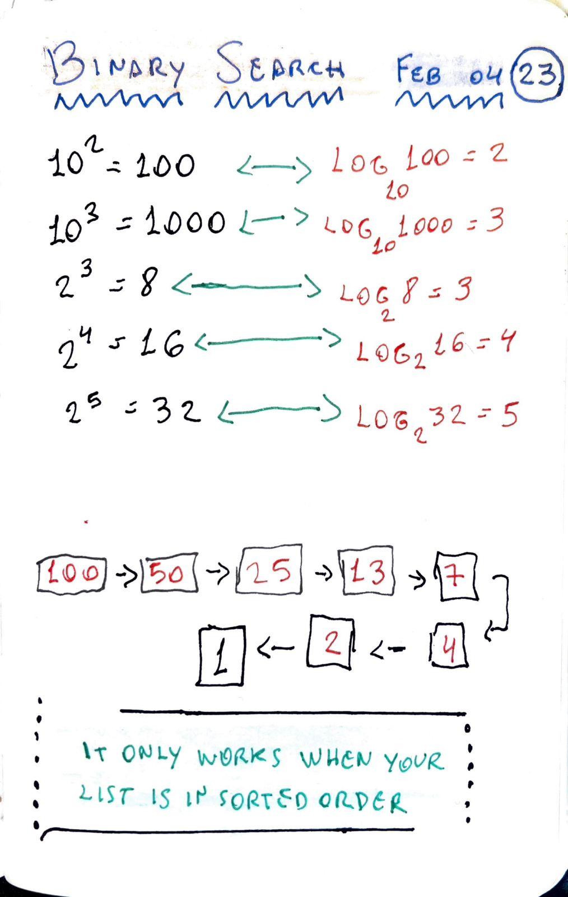

# Binary Search

> Binary search is an efficient algorithm for finding an item from a sorted list of items. It works by repeatedly dividing in half the portion of the list that could contain the item, until you've narrowed down the possible locations to just one.



## Full code

```JS
const list = [1, 2, 3, 4, 5, 6, 7, 8, 9, 10]

const binarySearch = (mylist, item) => {
  let start = 0
  let end = mylist.length - 1

  while (start <= end) {
    let mid = Math.floor((start + end) / 2)
    const guess = mylist[mid]

    if (item === guess) {
      console.log(`Yeahhh, item ${item} is in the index ${mid}`)
    }

    if (item < guess) {
      end = mid - 1
    } else {
      start = mid + 1
    }
  }

  return -1
}

binarySearch(list, 2)
```
