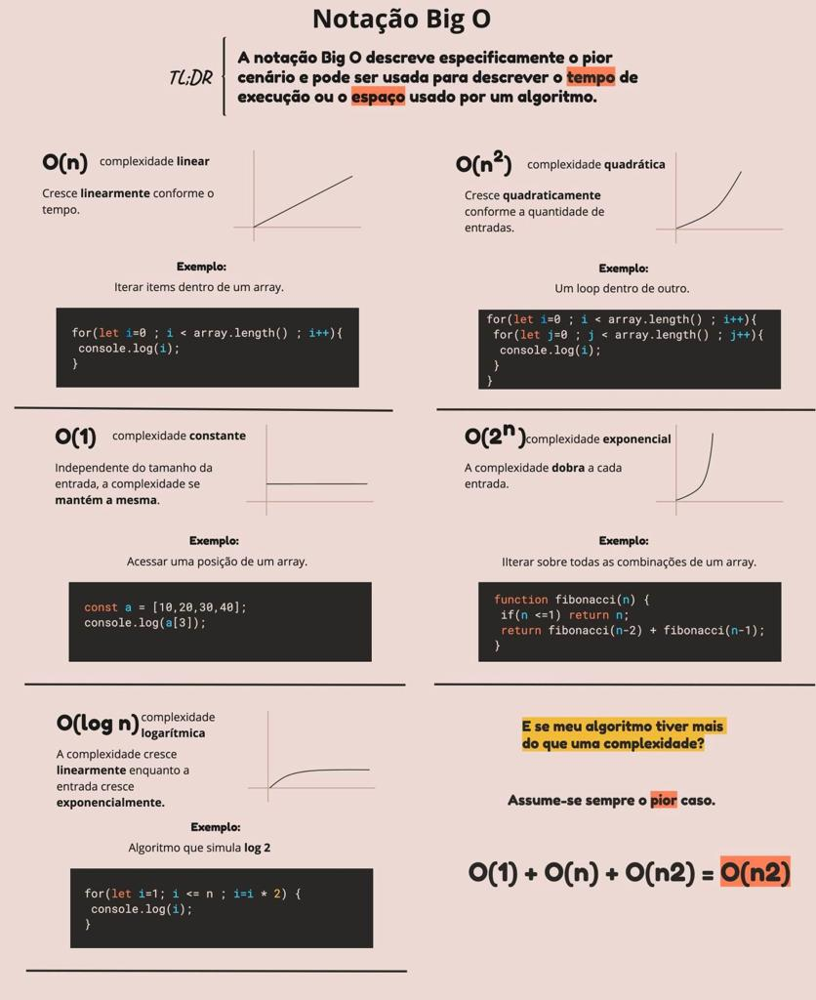

# The Big O notation

Big O notation isspecial notation that tells you how fast an algorithm is. Big O notation doesn't tell you the speed in seconds. Big O notation lets you compare the number of the operations. It tells you how fast the algorithm grows.

