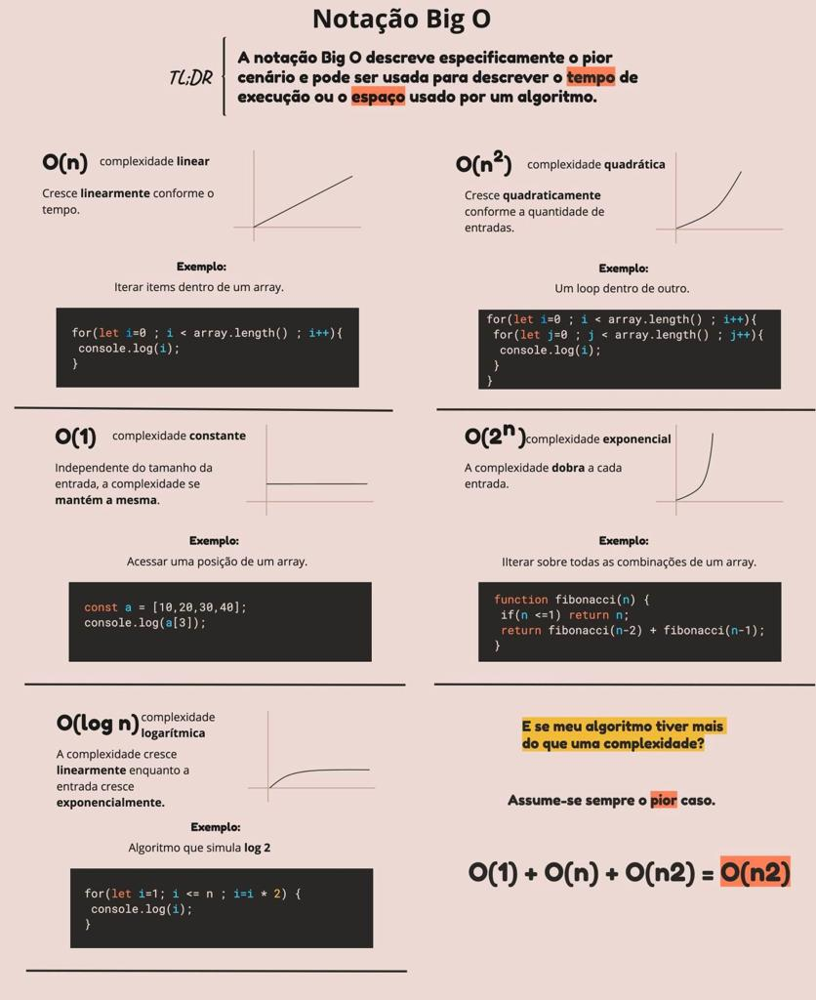
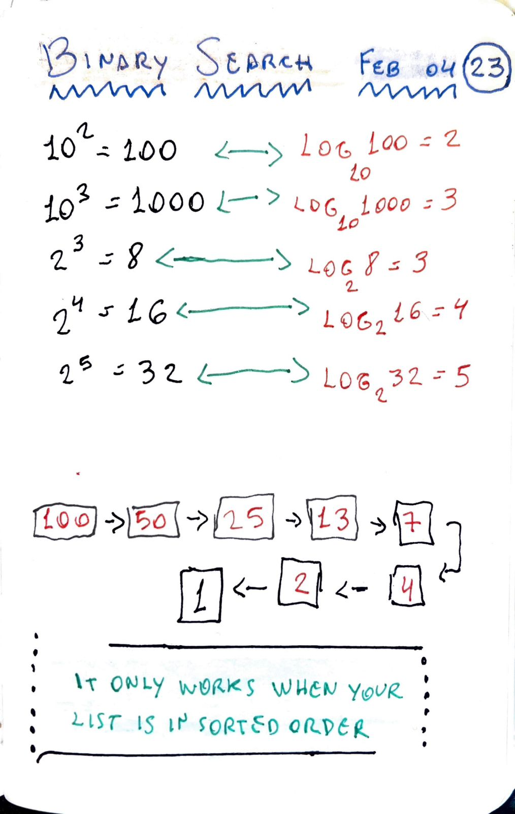

- [The Big O notation](#the-big-o-notation)
- [Binary Search](#binary-search)
  - [Example](#example)

## The Big O notation

Big O notation isspecial notation that tells you how fast an algorithm is. Big O notation doesn't tell you the speed in seconds. Big O notation lets you compare the number of the operations. It tells you how fast the algorithm grows.



## Binary Search

> Binary search is an efficient algorithm for finding an item from a sorted list of items. It works by repeatedly dividing in half the portion of the list that could contain the item, until you've narrowed down the possible locations to just one.



### Example

Try to guess my number in the fewst tries possible.

```JS
const list = [1, 2, 3, 4, 5, 6, 7, 8, 9, 10]

const binarySearch = (mylist, item) => {
  let start = 0
  let end = mylist.length - 1

  while (start <= end) {
    let mid = Math.floor((start + end) / 2)
    const guess = mylist[mid]

    if (item === guess) {
      console.log(`Yeahhh, item ${item} is in the index ${mid}`)
    }

    if (item < guess) {
      end = mid - 1
    } else {
      start = mid + 1
    }
  }

  return -1
}

binarySearch(list, 2)
// Yeahhh, item 2 is in the index 1
```
