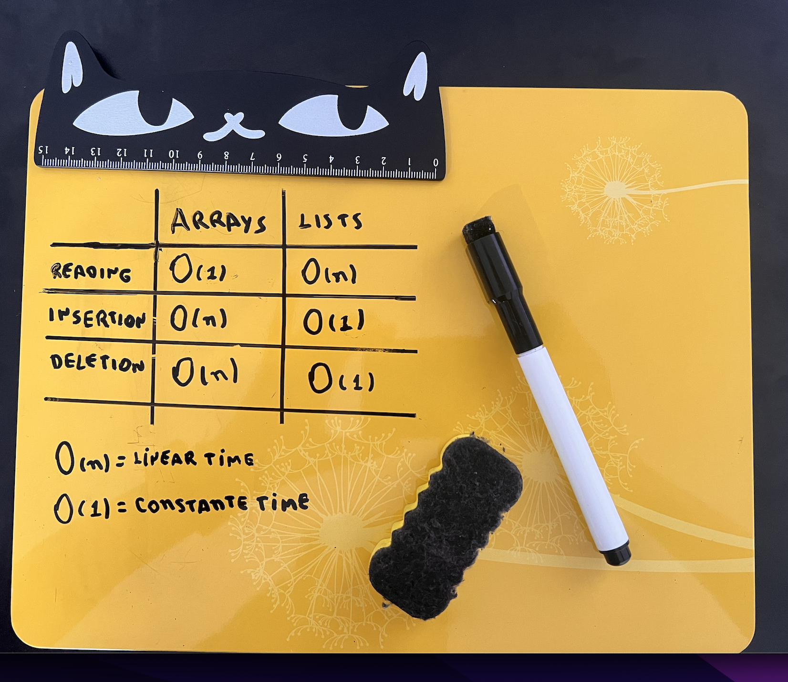

- [Arrays and Linked lists](#arrays-and-linked-lists)
- [Selection sort](#selection-sort)
  - [Example](#example)

## Arrays and Linked lists

Using Arrays means you can stored things contiguously (right next to each other) in memory, with linked lists, your items can be anywhere in memory and each item stores the address of the next item in the list.

Lists are better to deletions and insertions because you just need to change what the previous element points to. With array, everything needs to be moved up when you delete an element

> Run times for common operations on arrays and lists
> 

There are two different types to access an element:

- Sequential access means the reading the elements one by one, starting at the first element. Linked lists can only do sequential access. If you want to read the 10th element of a linked list, you have to read the fist 9 elements and follow the links to 10th element.
- Random access means you can jump directly to the 10th element. Arrays provide random access. Linked lists are good for inserts/deletes, and arrays are good for random access.

## Selection sort

Is a simple and efficient sorting algorithm that works by repeatedly selecting the smallest (or largest) element from the unsorted portion of the list and moving it to the sorted portion of the list. Selection sort is a neat algorithm, but it's not very fast.

### Example

- [Sort list](../chapter-2/code/selection-sort.js)
