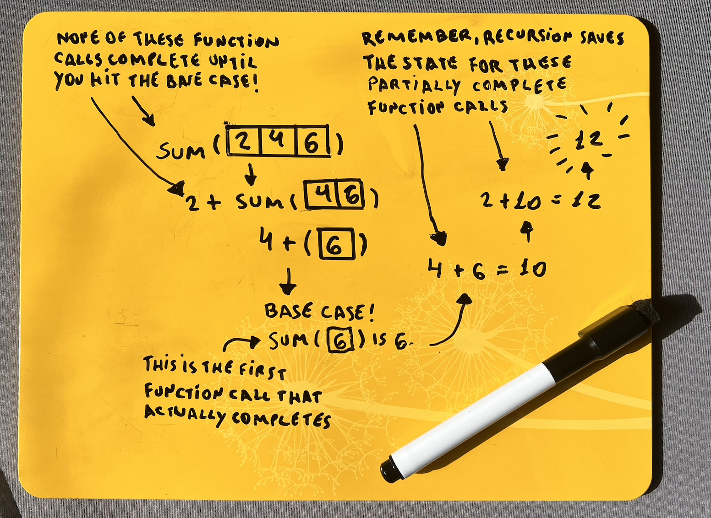

# Chapter 3

- [Chapter 3](#chapter-3)
  - [D\&C| Divider \& conquer](#dc-divider--conquer)
  - [Remember recursion](#remember-recursion)
  - [Example](#example)

## D&C| Divider & conquer

D&C gives you a new way to think about solving problems. D&C algorithms are recursive algorithms. There are two steps to solve a problem using it:

- Figure out the base case. This should be the simplest possible case.
- Divide or decrease your problem until it becomes the base case.

## Remember recursion

> When you're writing a recursive function involving an array, the base case is often an empty array or an array with one element. If you're stuck, try that first.

## Example

- [Recursive sum of array](./code/recursive-sum.js)
- [Find a maximum umber of array](./code/maximum-number.js)
- [Counting the number of array items](./code/number-of-items.js)
